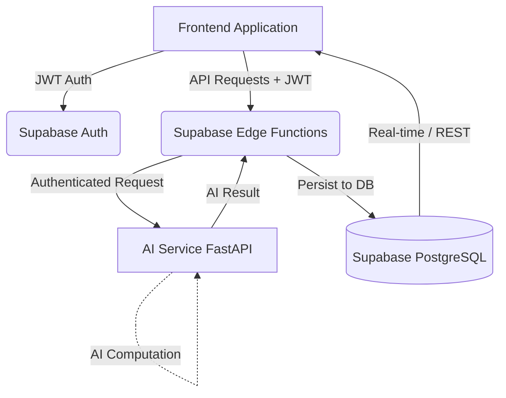

# AgriConnect Full Integration & Architecture Guide

Welcome to the AgriConnect Integration Guide. This document provides a comprehensive overview of the backend architecture, the keys and configuration required, and instructions for how all roles (Frontend, Backend, AI, Product Lead) integrate into the system.

## 1. System Architecture

AgriConnect follows a modern, decoupled architecture leveraging Supabase for the database/auth and a custom Python FastAPI backend for AI processing.



**Key Architectural Rules:**
1. **Frontend** NEVER talks to the database using the Service Role Key. It only uses the `Anon Key` and user `JWT`.
2. **AI Service** NEVER directly writes to the Supabase Database. It returns computed results to the Edge Function.
3. **Edge Functions** act as the secure orchestrator. They validate the user, forward requests to the AI Service, and securely write the result to the database.

---

## 2. Recent Backend Updates & Fixes (Today)
To ensure the backend is fully secure and ready for GitHub integration, the following tasks were completed today:
- **AI Service Fixes**: Fixed a `UnicodeEncodeError` in the AI Service (`main.py`) that crashed the server on Windows startup due to an unsupported emoji (✅).
- **Security Audit**: Audited `.gitignore` to ensure python virtual environments (`.venv/` and `ai-service/.venv/`) are ignored to prevent accidental leaks. Checked all files for hardcoded secrets.
- **Database & Testing**: Verified all 13 database migrations, checked RLS policies, ran Supabase local tests, and verified the API contract between Edge Functions and the AI Service.

---

## 3. Environment Variables & Keys Guide

Below are all the environment variables and keys required across the platform.

### Frontend Keys (Safe to expose via `.env` prefix like `NEXT_PUBLIC_`)
- `SUPABASE_URL`: Your Supabase Project URL (e.g., `http://127.0.0.1:54321` for local).
- `SUPABASE_ANON_KEY`: The safe, public key used to initialize the Supabase client on the web/mobile app.

### Backend & Edge Function Keys (NEVER expose to frontend)
- `SUPABASE_SERVICE_ROLE_KEY`: Admin key used inside Edge Functions to bypass RLS and securely save AI outputs or perform admin tasks.
- `CRON_SECRET`: A custom secret used to protect the `refresh-market-prices` edge function so only scheduled triggers can run it.
- `AI_API_URL`: The URL where the AI Service is running (e.g., `http://host.docker.internal:8000` for local Edge Functions).
- `MARKET_PRICE_API_URL` & `MARKET_PRICE_API_KEY`: External credentials for OGD Platform India (data.gov.in) to fetch mandi prices.

### AI Service Keys (`ai-service/.env`)
- `DATA_GOV_API_KEY`: Used to query Agmarknet Mandi prices.
- `SUPABASE_URL` & `SUPABASE_JWT_SECRET`: Used locally by the FastAPI server to decrypt and verify the caller's Supabase JWT without needing a network round-trip.

---

## 4. Role-Specific Integration Guides

### 👨‍💻 Frontend Team
**Your Goal:** Authenticate the user and request AI recommendations.
1. Use `supabase.auth.signInWithPassword()` to log the user in.
2. To request a recommendation, do not call the database directly. Instead, call the Edge Function:
   ```javascript
   const { data, error } = await supabase.functions.invoke('recommend', {
     body: { latitude: 20.0, longitude: 78.0, season: 'kharif', soil_type: 'black', irrigation_type: 'drip', land_size: 2.5 }
   });
   ```
3. Read the result from the response and display it. The Edge Function securely writes the result to the `crop_recommendations` table for history.

### 🤖 AI Engineering Team
**Your Goal:** Maintain the Python FastAPI endpoints and crop recommendation logic.
1. Do not install database drivers to insert data into Supabase. You are purely a computation engine.
2. Ensure you validate the Supabase JWT using the `SUPABASE_JWT_SECRET` in `auth.py`.
3. Provide your endpoints (e.g., `/api/recommend`, `/api/market/prices`) to the Backend Team.

### ⚙️ Backend Team
**Your Goal:** Write Edge Functions and Database Migrations.
1. When creating new API routes that require secrets (e.g., calling the AI Service), write a Supabase Edge Function using Deno.
2. Always verify the `Authorization` header inside the Edge Function.
3. Perform database inserts using the `SUPABASE_SERVICE_ROLE_KEY` inside the Edge Function.
4. Keep all migrations idempotent and enforce strict Row Level Security (RLS) on all tables.

### 👔 Product Lead
**Your Goal:** Monitor the end-to-end integration and platform analytics.
1. Track production readiness: The platform is Backend-Ready, but requires Frontend integration testing.
2. Secure Production Keys: Ensure that the `SUPABASE_JWT_SECRET` and `SERVICE_ROLE_KEY` are safely managed in your production Supabase dashboard.
3. Call the `analytics` Edge Function using an Admin account JWT to retrieve platform-wide metrics on crop demand and AI recommendations.
