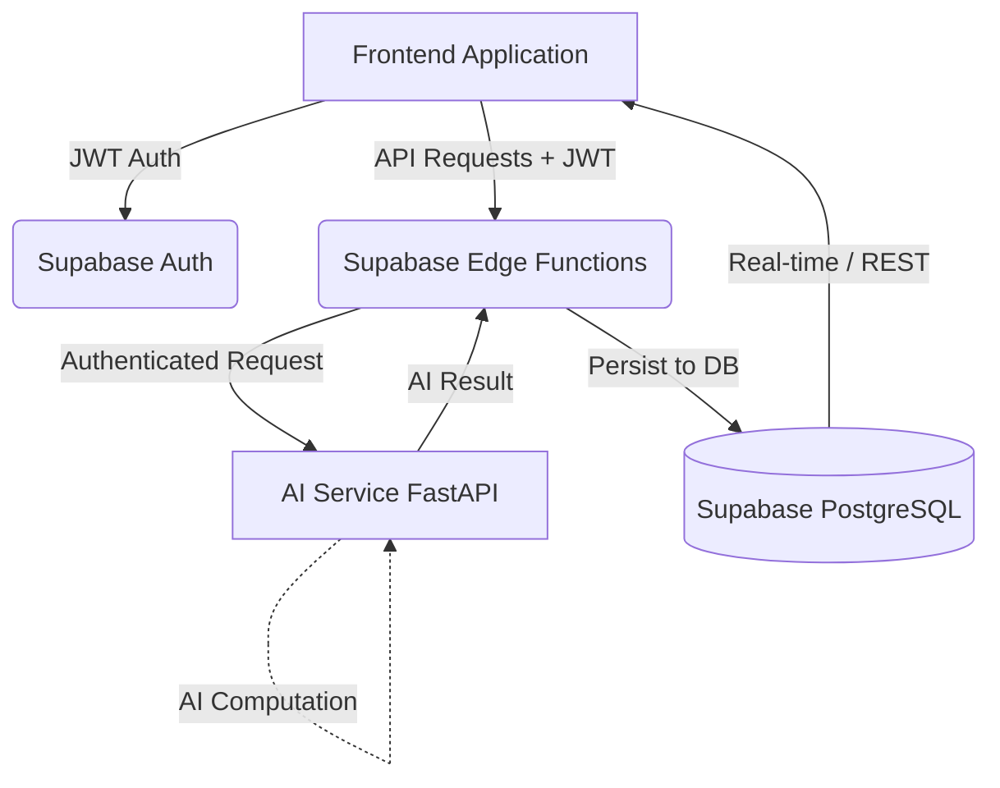

# AgriConnect Full Integration & Architecture Guide

Welcome to the AgriConnect Integration Guide. This document provides a comprehensive overview of the backend architecture. For keys, configuration, and role-specific setup, please see the [Backend Integration & Setup Info](./BACKEND_INTEGRATION_SETUP.md) document.

## 1. System Architecture

AgriConnect follows a modern, decoupled architecture leveraging Supabase for the database/auth and a custom Python FastAPI backend for AI processing.

**Key Architectural Rules:**
1. **Frontend** NEVER talks to the database using the Service Role Key. It only uses the `Anon Key` and user `JWT`.
2. **AI Service** NEVER directly writes to the Supabase Database. It returns computed results to the Edge Function.
3. **Edge Functions** act as the secure orchestrator. They validate the user, forward requests to the AI Service, and securely write the result to the database.

---

## 2. Recent Backend Updates & Fixes (Today)
To ensure the backend is fully secure and ready for GitHub integration, the following tasks were completed today:
- **AI Service Fixes**: Fixed a `UnicodeEncodeError` in the AI Service (`main.py`) that crashed the server on Windows startup due to an unsupported emoji (✅).
- **Security Audit**: Audited `.gitignore` to ensure python virtual environments (`.venv/` and `ai-service/.venv/`) are ignored to prevent accidental leaks. Checked all files for hardcoded secrets.
- **Database & Testing**: Verified all 13 database migrations, checked RLS policies, ran Supabase local tests, and verified the API contract between Edge Functions and the AI Service.

---

**Note:** For the complete list of environment variables, API keys, and step-by-step role integration (Frontend, Backend, AI Engineering, Product Lead), please refer to the [Backend Integration Setup](./BACKEND_INTEGRATION_SETUP.md) guide.
